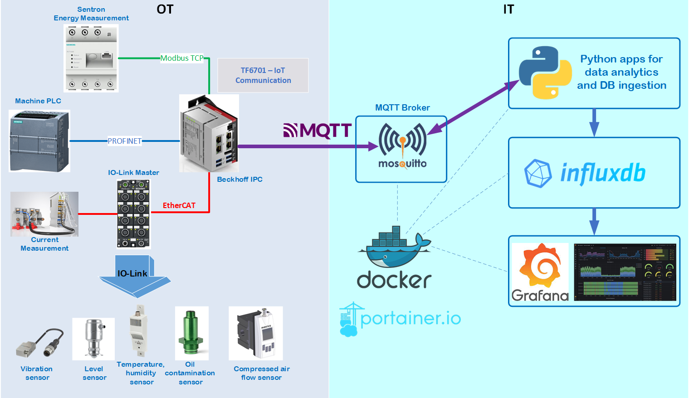
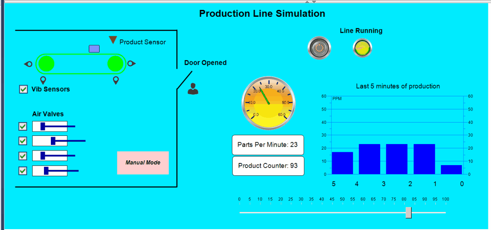
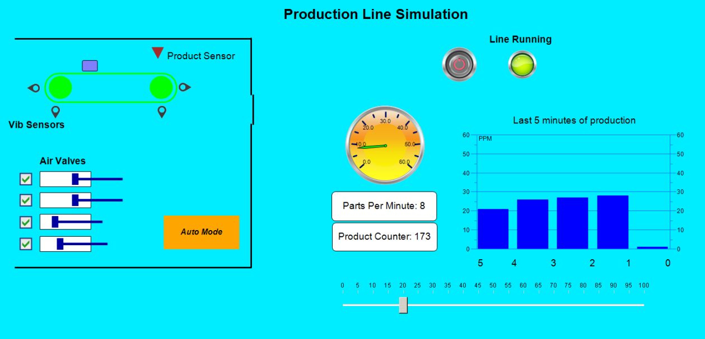

# IIoT Real-Time Analytics using MQTT and Beckhoff IPC

IIoT project for data exchange between PLC in OT and IT area with usage of MQTT protocol and data analytics.

## System Diagram

## General Overview
Using this framework it's possible to collect data from different sensors, PLCs and devices in OT area. 
The collected data are preprocessed in Beckhoff IPC, converted into JSON payload and published with MQTT into IT area.

In IT area, there are couple of containerized applications which run using Docker (Docker-Compose) and Portainer. 
Python apps (as opc ua clients) request data from Bechkoff IPC (as opc ua server) and perform analytics, anomaly detection in sensor signals and finally save the results in time series database InfluxDB. 
The graphical results are visible as dashboards in Grafana.

This repo includes exclusively code for PLC Beckhoff in TwinCat3. The software framework of IT area is placed in separated GitHub repo.

The TwinCat project includes simulation where simplified real-world industrial line with devices and components can generate data and publish it over MQTT  

